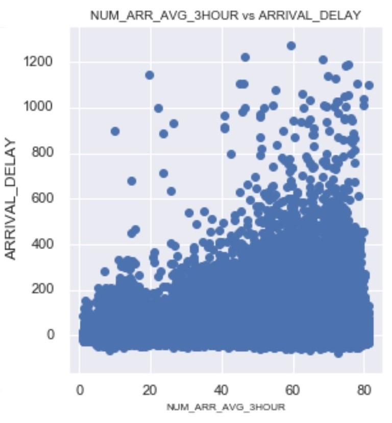

#  Predicting Flight Delays (<i>a Proof-of-Concept</i>)

## Contents:
- [Overview and Problem Statement](#Overview-and-Problem-Statement)
  1. [Overview](#Overview)
  2. [Problem Statement](#Problem-Statement)
- [Summary of Dataset](#Summary-of-Dataset)
  1. [Source of Datasets](#Source-of-Datasets)
  2. [Brief description of datasets](#Brief-description-of-datasets)
- [Data Cleaning Processes and Key Issues](#Data-Cleaning-Processes-and-Key-Issues)
- [EDA and Feature Engineering](#EDA-and-Feature-Engineering)
- [Methodologies, Their Metrics & Limitations](#Methodologies,-Their-Metrics-and-Limitations)
  1. [Binary Classification Modelling for All Routes](#1.-Binary-Classification-Modelling-for-All-Routes)
  2. [Regression Modelling for All Routes](#2.-Regression-Modelling-for-All-Routes)
  3. [Regression Modelling for Single Route](#3.-Regression-Modelling-for-Single-Route)
  4. [Multiclass Classification Modelling for Single Route (Final Methodology Deployed)](#4.-Multiclass-Classification-Modelling-for-Single-Route-(Final-Methodology-Deployed))
- [Conclusion and Further Research](#Conclusion-and-Further-Research)

<b>NOTE:</b> <i>The repository will not include the flight data due to the huge size of it. You can get the data from the kaggle source mentioned below if you need it</i>

---
## Overview and Problem Statement

### <u>Overview</u>

"Delays are costly for airlines and their passengers. A 2010 study commissioned by the Federal Aviation Administration estimated that flight delays cost the airline industry $8 billion a year, much of it due to increased spending on crews, fuel and maintenance. Delays cost passengers even more — nearly $17 billion."

-"https://mashable.com/2014/12/10/cost-of-delayed-flights/"

As small a problem as a minor delay might be, studies have shown that a single flight delay could have rippling effects on subseqent connecting flights. This is not just an issue with airlines, but aerodromes (airports) as well.

MI235 was scheduled to land in Changi Airport at 1235UTC, and planned to park at bay F52, some of its passengers have a connecting flight for SIA21 to the US. However due to a delay at the origin airport, MI235 will be landing at 1310UTC.

SIA21 parked at bay A11 is scheduled to depart at time 1330UTC. The timing was planned with consideration of the connecting passengers from MI235. Because of the delay of MI235, SIA21 is now delayed slightly and will be departing at 1400UTC.

SIA656 is scheduled to land in Changi Airport at time 1330UTC is scheduled to park at bay A11, the bay SIA21 is still occupying and will continue to occupy due to the delayed departure. SIA656 touches down on the runway on time at 1330UTC, and by the time apron control realizes the conflict in the parking bay, the damage is already done.
Apron phones ATC to request that they hold the aircraft on the taxiway while they figure out another bay and get the ground handling agents to rush there for the newly arrived aircraft.

(scenario is fictional)

As an Air Traffic Controller trainee previously, it is not uncommon to recieve requests from apron control for a bay change for an incoming arrival because of the delays of another flight. The rippling impact of an undetected delayed flight has great impact not just on the costs to the airlines, but also the undesired "surprises" on the ground operations of the aerodrome.

---
### <u>Problem Statement</u>

**Can we accurately predict flight delays after it has began pushing back from its origin aerodrome?**

---
## Summary of Dataset

### <u>Source of Datasets</u>:

Our final dataset is a combination from the following sources:

1. Kaggle/US DOT Bureau of Transportation Statistics - _'https://www.kaggle.com/usdot/flight-delays'_
2. OGIMET - _'https://www.ogimet.com/'_

### <u>Brief description of datasets</u>:

1. Kaggle/US DOT Bureau of Transportation Statistics

The dataset consists of 3 files:
> 1. airlines.csv - Airline information
> 2. airports.csv - Airport information
> 3. flights.csv - Domestic flight information in US for year 2015

2. OGIMET

The webpage is the source of our weather data. For the purpose of this project, we used the API to retrieve the METAR & SPECI reports for Atlanta International Airport for the year 2015.

---
## Data Cleaning Processes and Key Issues

**1. <u>Extracting Weather Data</u>**

i. Scraping METAR data using OGIMET API and saving as text

ii. Extracting relevant METAR data from txt format and population a dataframe for storing & export

<b><u>Key Issues:</u></b>
  - <i>In a real world situation, we will only be able to get the TAF which is the weather forecast. METAR is the actual weather observed at the time while SPECI is the ammended weather observed if it fluctuates above a certain threshold. For the purpose of this project, we will not take SPECI into account for the models and will solely depend on METAR readings for our predictions.</i>

  - <i>For real life predictions, we will replace METAR reports with TAF reports and take in the inaccuracies of the TAF reports as a variance of our model.</i>

**2. <u>Cleaning Weather Data</u>**

i. Cleaning features to correct values & representation

ii. Changing features to correct dtype

iii. Dropping weather features serve no purpose in subsequent modelling

<b><u>Key Issues:</u></b>
  - <i>We should have 8760 rows of readings, but after we dropped the duplicates, we only have 3739 rows. It is likely that there are missing rows of data within for certain hours (highly likely to be MCAR). We will continue with 8739 rows of data as of now and later on drop the combined data with no weather.</i>

**3. <u>Extracting & Exploring KATL Flight Data</u>**

i. Extracting only KATL flights from overall dataset

ii. Exploring extracted KATL data to see if we have sufficient data for analysis & modelling

<b><u>Key Issues:</u></b>
  - <i>We shall set our objectives to classify arrival delay which have <u><b>began their departure</b></u>.</i>
    > <i>For this, we will take Departure Delay _(the difference between actual time in which the aircraft started pushing back and the scheduled time of pushback)_ into consideration when doing predictions. Which effectively means the model is only usable after an aircraft is confirmed for departure and has started commencing departure pushback.</i>

  - <i>Do note that there are information in the dataset which we usually do not have the luxury of having till the actual event actualizes. As such we need to consider if we want to include them into the model later on (might not be realistic for real life usage).</i>

  - <i>Our initial intention was to include enroute weather data into the model. However the data is very difficult to get our hands on. As such we will make the assumption that scheduled flight duration is done properly by the airlines with enroute weather taken into consideration.</i>
    > <i>The scheduled time will already consider enroute weather conditions _(e.g. strong enroute tail wind -> shorter flight duration)_ and as such we do not need to include it in the data. However, TAF or terminal METAR will still matter simply cause a very poor condition will cause diversions or holding delays due to the aircraft's inability to land</i>

**4. <u>Cleaning Flight Data & Combining Datasets</u>**

i. Cleaning flight data

ii. Deductive imputing/dropping of missing data

iii. Merging flight, airlines, airports & weather (METAR) data into single dataframe

<b><u>Key Issues:</u></b>
  - <i>Merging METAR and flight data is alot harder as we will need to match the correct METAR data to the correct flight. The strategy is to take the 1 hour aggregated data prior to every flight's landing. Because the purpose of the model is to predict delays, we will map the weather to the SCHEDULED_ARRIVAL time. So basically, we are looking at each entry as the weather which it will experience when it arrives at the scheduled arrival time.</i>
  - <i>SCHEDULED_ARRIVAL time data for flights to KATL is 5 hours behind UTC (the time used for the METAR data is in UTC), as such we will need to adjust accordingly.</i>
  <i>Effectively when we shift the hours behind by 5 to adjust for local & UTC timings, the last 5 hours of the flight weather data should be taken from 2016 weather (cause the KATL local time is 5 hours ahead of UTC). Do note that because of the time difference, the last 5 hours of 31st Dec 2015 will need to take weather data from the first 5 hours of 2016. To simplify things, and also because we do not have 2016 data, we will drop all data on the last day of 2015.</i>

---
## EDA and Feature Engineering

<i>While we eventually intend to build a model for every single route, we will be conducting EDA on the entire KATL dataset just to understand our dataset better</i>

**1. <u>Feature Engineering</u>**

<b>Features created are:</b>

a. <b>ARRIVAL_DELAY/NO_DELAY feature</b> - This feature is purely for overall EDA purposes later on

b. <b>NUM_ARR_AVG_3HOUR feature</b> - This feature will help us understand the competition which a flight faces for landing slots.
  > <i>Now we can take the count of arrivals scheduled to land 1 hour prior to flight OR take the count 1 hour before & prior to the flights actual scheduled arrival time. But in reality, what the actual flight experiences would be very different (due to delays, early arrivals, etc) and also manipulating the data for the required feature would be a complex process. Since our purpose of this feature is to have a rough sense of how long or how many other aircrafts are projected to be competing with the flight for landing queue, we have decided to keep it simple by averaging the 3 hour window (h-1 to h+1) of the count of arrivals.</i>

  > <i>The dataset is only comprising of domestic flights within the US as shown above. Now this poses an issue that the NUM_ARR_IN_HOUR feature will not capture the actual number of flights scheduled to arrive in that hour (due to missing international flight data). The flights into KATL consists of approximately 90% domestic & 10% international. We have elected to continue using only the domestic flight data and we assume that the machine will adjust its weights accordingly to the scaled inputs (to simply capture the impact of the changes in magnitude)</i>

c. <b>crossind_comp feature</b> - This feature will help calculate the various crosswind component a flight experiences on landing.

**2. <u>EDA</u>**

i. Departure Delay vs Arrival Delay Plot
# 
<i>Plot seem to suggest that departure delays have a subsequent linear impact on arrival delays</i>

ii. Average no. of arrivals in 3 hour window vs Arrival Delay deployment
# 
<i>Plot seem to suggest that an increased competition for landing will potentially lead to an increase in arrival delay.</i>
<i>We ran an ANOVA test and the p-value of 7.398e-79 is <0.05 and hence the feature has significance in causing arrival delays.</i>

iii. Arrival Delays by Airlines
# 
# 
<i>Whilst Delta Air accounts for the most number of domestic delayed flights, Frontier Airlines is the one which has the highest average delay per flight.</i>

iv. Arrival Delays by Origin Airport
# 
# 
<i>Whilst LaGuarda Airport accounts for the most number of domestic delayed flights, Hector International Airport is the one which accounts for the highest average delay per flight.</i>

v. Arrival Delay by Distance (between the 2 airports)
# 
<i>Plot shows that majority of delays are from airports which are <1000nm away from KATL.</i>

vi. Arrival Delay by Late Aircraft Arrivals
# 
<i>Plot shows that majority of delays also experienced a prior late aircraft delay of <200 minutes.</i>

vii. Arrival Delay by Crosswind Component
# 
# 
<i>As we look at the chart, we might think that high crosswinds have lesser impact on delaying a flight. On the contrary, based on my experience as an Air Traffic Controller, this is not the case. When the crosswinds are very high/extreme (maybe in the ranges above 5kts) aircrafts might choose to hold and wait out the weather instead of attempting to land. And this might not be reflected in the 'Amount of Arrival Delay' above as the amount of arrival delay could be dominantly influenced by other factors. (i.e. Even tho it seems that the higher delays of 1200 mins seem to be in the 5kts range, it could be due to other factors like late aircraft delays, etc; and these factors dominate outcome over the impact of crosswind component)</i>

<i>At most airports, crosswinds above 35kts prohibit landings and take off. Based on experience, at wind speeds above 25kts you will start seeing minor delays, depending on airport configuration and aircraft type. At around 40kts the delays will start becoming significant.</i>

<i>As such crosswinds do play a role in causing delays, despite how the plot above looks like.</i>

**3. <u>Dropping Anomalies</u>**

Per ICAO Annex 6, Part I, section 4.3.6 "Fuel Requirements," airplanes should calculate their required fuel quantity as follows (summary; see below for actual ICAO text):

1. Taxi fuel
2. Trip fuel (to reach intended destination)
3. Contingency fuel (higher of 5% of "trip fuel" or 5 minutes of holding flight)
4. Destination alternate fuel (to fly a missed and reach an alternate)
5. Final reserve fuel (45 minutes of holding flight for reciprocating engines, 30 minutes for jets)
6. Additional fuel (if needed to guarantee ability to reach an alternate with an engine failure or at lower altitude due to a pressurization loss)
7. Discretionary fuel (if the pilot in command wants it)

From our dataset, we have _scheduled time_ and _actual airtime_. Assuming the fuel consumption is constant to flight time, our _scheduled time_ is actually our taxi fuel & trip fuel.

Our contingency fuel would translate to about extra 5 minutes.

A safe estimate (that all diverted flights would hold enough fuel to the furthest diversion aerodrome, Knoxvile Airport), would be that the contingency fuel would be an average of 31 minutes (we will take 40 minutes to try and capture the upper limit)

Additional reserve fuel would lead to an extra 30 mins of flight time (but we would not include this as usually by this time, the flight would likely have been calling for a fuel emergency)

We shall ignore discresionary fuel for the unpredictable nature of it.

<b>So for a flight of X hours _(scheduled time)_ we would expect the flight to be capable of being delayed for (before havin to divert or call for fuel emergency):</b>

    X + 5 + 40 + 30mins

<b>Hence if a flight's _actual airtime_ is greater than this delay timing, we would categorize it as an anomaly and drop it</b>

---
## Methodologies, Their Metrics and Limitations

In summary, the following are the methodologies which we have tried:
1. Binary Classification Modelling for All Routes (<i>followed by Regression for delayed flights</i>)
2. Regression Modelling for All Routes
3. Regression Modelling for Single Route
4. Multiclass Classification Modelling for Single Route (Final Methodology Deployed)

<i>Note: For Single Route modelling, we are only doing it for the top 5 routes with most delays as a proof-of-concept.</i>

### 1. Binary Classification Modelling for All Routes

Best performing model: XGBoost

Evaluation Metrics (<i>Positive class is delayed flights</i>):

| Metric           | Score  |
|:-----------------|:-------|
| Sensitivity      | 77.06% |
| Specificity      | 98.99% |
| AUC-ROC          | 0.8802 |
| Overall Accuracy | 95.82% |

**Comments**
- The sensitivity of the model is significantly lower than the accuracy.

### 2. Regression Modelling for All Routes

Caveat: Model is trained only on flights which are considered to be delayed (delay >15mins)
Best performing model: XGBoost

Evaluation Metrics:

| Metric    | Score     |
|:----------|:----------|
| RMSE      | 15.2 mins |
| R-Squared | 0.9646    |

# 
# 

**Comments**
- There is heteroscadacity in the residuals. Because of this issue, we further explored the next option of <b><i>Regression Modelling for Single Route</b></i>. The rationale was that perhaps there could be factors for each individual routes which differ in variation from another and these factors have increasing influence at the lower delays, thereby causing the high variance at the start.

### 3. Regression Modelling for Single Route

Caveat: Model is trained only on flights which have delays <420mins (<i>We are trying to narrow our scope and remove extreme values in an attempt to reduce heteroscedacity</i>)
  >Rationale: Customers would have to be compensated after delays exceed 3 hours (for EU). Since we are looking at US and they DO NOT have any form of obligated compensation for flight delays, we shall use 420mins(7hours) as a benchmark. Also, if delays are long, airlines would likely reschedule the departure to a later timing.

Best performing model (for the 5 routes): XGBoost

Evaluation Metrics:

| Model & Metric         | ORD       | LGA       | PHL       | DFW       | MCO       |
|:-----------------------|:----------|:----------|:----------|:----------|:----------|
| RandomForest RMSE      | 7.80 mins | 7.62 mins | 8.38 mins | 6.16 mins | 2.89 mins |
| RandomForest R-Squared | 0.69622   | 0.58489   | 0.54601   | 0.62830   | 0.63326   |
| XGBoost RMSE           | 7.68 mins | 7.46 mins | 7.99 mins | 5.42 mins | 2.09 mins |
| XGBoost R-Squared      | 0.71376   | 0.63578   | 0.55465   | 0.64771   | 0.65851   |
| Neural Network RMSE    | 8.11 mins | 9.05 mins | 9.09 mins | 6.75 mins | 2.89 mins |

<i>Note: We will only be showing the residual rlots for the XGBoost model for ORD route as the other plots are very similar</i>

# 
# 
# 

**Comments**
- As we can see, by modelling the delay route by route, we significantly improve our RMSE value.
- However, the R-Squared value dropped as well. This I believe is likely due to the reduced number of features included for the regression of each route. We can check the Adjusted R-Squared value another time, but I believe this to not be a significant issue as it is still considered to have a moderate effect on the output.
- There is still heteroscedacity in the residuals. The following might explain the phenomenon observed:

  >When the delays are low, there are too many possible factors affecting the amount of delays (e.g pilot mistakes, ATC mistakes, another aircraft on the taxiway causing delays). As the delays increase, the possibilities/noise are "even-ed" out by more stable concrete factors. Hence the decrease of variance in prediction as time proceeds on. I believe this heteroscedastic nature is nearly impossible to handle without decreasing the RMSE of the model (which would likely render the model useless practically).

  >Hence to work-around this issue, We can perhaps follow a guideline of only trusting the model

  >1. when the predictions are above the 1 SD mark (or when predicted delays are >37mins (for ORD only, other routes have different threshold for 1 SD)).

  >2. OR we can build a multiclass classification model to help bin the delays into 1 hour periods (which we will do in our final model).

### 4. Multiclass Classification Modelling for Single Route (Final Methodology Deployed)

Best performing model (for the 5 routes): XGBoost

Explanation on the multiclass targets:
<u>We will be classifying the delays into 3 groups:</u>
1. <15 minutes _(group 0)_
2. 15 minutes to 1 hour _(group 1)_
3. 1 hour to 3 hours _(group 2)_
4. above 3 hours _(group 3)_

<u>Rationale:</u>
1. _(<15mins) belong to the no delay category where things are normal_
2. _(15mins to 1hr) will be the category in which the airport or airline will perhaps decide if a reshuffling of ground resource deployment is needed_
3. _(1hr to 3hr) will be the category in which the airline or airport will perhaps decide on the necessary actions to take to mitigate the impact of the delays (e.g. rescheduling transit passengers to another flight to prevent delaying the departure of the connecting flight, etc)_
4. _(>3hrs)_ will be the category in which compensation is technically already due (for EU) and airlines or airports will perhaps decide on how to do "damage control"

_Note: Customers would have to be compensated after delays exceed 3 hours (for EU). Since we are looking at US and they DO NOT have any form of obligated compensation for flight delays, we shall use EU as a benchmark for the last class (> 3 hours). Also, if delays are long, airlines would likely reschedule the departure to a later timing._

Evaluation Metrics (of best models):

A. ORD XGBoost Evaluation Metric

|                  | precision | recall | f1-score |
|:-----------------|:----------|:-------|:---------|
| <15mins          | 0.94      | 0.96   | 0.95     |
| 15mins to 1hr    | 0.72      | 0.59   | 0.65     |
| 1 to 3hrs        | 0.81      | 0.81   | 0.81     |
| >3hrs            | 0.84      | 0.91   | 0.87     |
| Overall Accuracy ||| 0.90                        |

B. LGA XGBoost Evaluation Metric

|                | precision | recall | f1-score |
|:---------------|:----------|:-------|:---------|
|        <15mins |     0.95  |   0.99 |    0.97  |
|  15mins to 1hr |     0.80  |   0.59 |    0.58  |
|      1 to 3hrs |     0.80  |   0.75 |    0.78  |
|          >3hrs |     0.74  |   0.92 |    0.82  |
|Overall Accuracy|||                         0.92|

C. PHL XGBoost Evaluation Metric

|                | precision | recall | f1-score |
|:---------------|:----------|:-------|:---------|
|        <15mins |     0.93  |   0.98 |    0.96  |
|  15mins to 1hr |     0.75  |   0.55 |    0.63  |
|      1 to 3hrs |     0.83  |   0.77 |    0.80  |
|          >3hrs |     0.87  |   0.93 |    0.90  |
|Overall Accuracy|||                         0.91|

D. DFW XGBoost Evaluation Metric

|                | precision | recall | f1-score |
|:---------------|:----------|:-------|:---------|
|        <15mins |     0.96  |   0.97 |    0.96  |
|  15mins to 1hr |     0.68  |   0.65 |    0.66  |
|      1 to 3hrs |     0.80  |   0.74 |    0.77  |
|          >3hrs |     0.81  |   1.00 |    0.89  |
|Overall Accuracy|||                         0.92|

E. MCO XGBoost Evaluation Metric

|                | precision | recall | f1-score |
|:---------------|:----------|:-------|:---------|
|        <15mins |     0.97  |   0.99 |    0.98  |
|  15mins to 1hr |     0.84  |   0.70 |    0.76  |
|      1 to 3hrs |     0.85  |   0.76 |    0.80  |
|          >3hrs |     1.00  |   0.92 |    0.96  |
|Overall Accuracy|||                         0.95|

**Comments**
- For most of the models, the 2nd class of delays between 15mins to 1hour seem to perform significantly lower than the other classes. This could very likely be due to the phenomenon of high variance at low delay explained above
- The multiclass classification model yields decent results and seem to fit the operational purposes better.

**For a demonstration of the deployed model, visit:** https://flightpredictions.herokuapp.com/

<i>Note: The model deployed on the webpage is RandomForest, not XGBoost (due to model exporting issues). The performance is slightly lower and if I do resolve the issue and upload it, I will update it here.</i>

## Conclusion and Further Research

**Limitations:**
The entire model is trained only using 2015 USA domestic flight data. And as such our findings are only limited to the data which we have. Other potential considerations which we can include in the future are:

i. Including all international flights

ii. Incorporating enroute weather data

**Further Research:**
<b>One of the few interesting realization while doing this project are:</b>

a. When the delays are low, there are too many possible factors affecting the amount of delays (e.g pilot mistakes, ATC mistakes, another aircraft on the taxiway causing delays). As the delays increase, the possibilities/noise are "even-ed" out by more stable concrete factors. Hence the decrease of variance in prediction as time proceeds on. I believe this heteroscedastic nature is nearly impossible to handle without decreasing the RMSE of the model (which would likely render the model useless practically).

The seemingly heteroscedastic nature of delays has significantly increased the complexity in trying to predict it. Perhaps further studies should be done on it to help us better predict delays in the future.

b. The impact of weather on delays seem to diminish with greater distance between the 2 airports. The hypothesis makes logical sense as the further the distance, the more "buffer" the flight has to make up for time and as such would be less affected by approach weather. Further studies could be done on this to help us understand the impact of weather on delays more.
